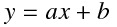
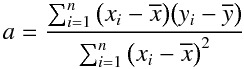
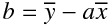

# Linear Regresion Project

## Basics
The main task of this program is to model the relationship between two variables by fitting a linear equation to implemented data. 

A linear regression line has an equation of a form

Where _a_ stands for a slope of the line and _b_ is the value of _y_ when _x_ = 0 (intercept value)

We can calculate the _a_ and _b_ with help of _Least-squares_ method.
This method minimizes the sum of the squares of the vertical deviations from each data point to the line.
Each deviation is squared that is why the positive and negative values will not cancel each other.
The value of _a_ can be determined by a formula

After we calculate _a_ the _b_ can be determined by a formula

In my program this equation is performed in _calcLine()_ method.
This function first calculates the average of my arguments ( _avgX_ ) and their values ( _avgY_ ).
Then the rest of equation is performed 

~~~javascript
let sumDelta = 0;
let sumDeltaX2 = 0;

data.forEach(vec => {
	//sumDelta is variable holding the sum of numerator
	sumDelta += (vec.x - avgX) * (vec.y - avgY);
	//sumDeltaX2 is variable holding the sum of denominator 
	sumDeltaX2 += pow(vec.x - avgX, 2);
});

let a = sumDelta / sumDeltaX2;
let b = avgY - a*avgX;
~~~

## Data visualisation

To visualize the data I used p5js library.
I have chosen this library due to the fact that it is very easy to use. 
However there appeared a small problem with drawing point to the screen.
The problem resulted from the location of point (0, 0). 
On my canvas it is placed in the upper left corner but I wanted to have it in the bottom left corner. 
That is why I use p5js _map()_ function to scale my axis. 

This function takes 5 arguments.
First argument is the value I want to scale. 
Next two arguments are the bounds of the values current range. 
Following two arguments are the bounds of the target values range.

New points can be added to the canvas by mouse clicks. 
The line is constantly updated, so you can see how it changes when new points are appended. 
